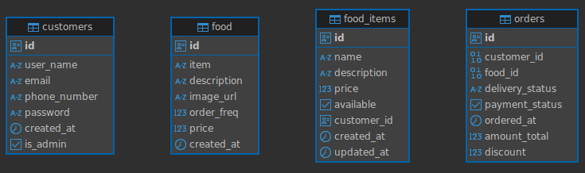

# Project tupike_hotel

>>>>>>>>>>>>>>>>>>>

## Getting Started

## Task

Routes → API (Handlers) → Service → Repository → Database

Handler (API Layer): Handles HTTP requests and responses.

Service Layer: Contains business logic and calls repository methods.

Repository Layer: Handles direct database queries via Bun ORM.

Database Layer: Manages database connection (initialization, health checks, etc.).

SQL ERD:
